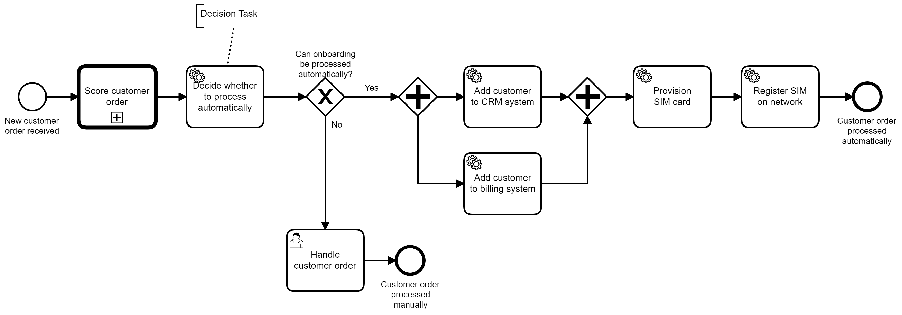
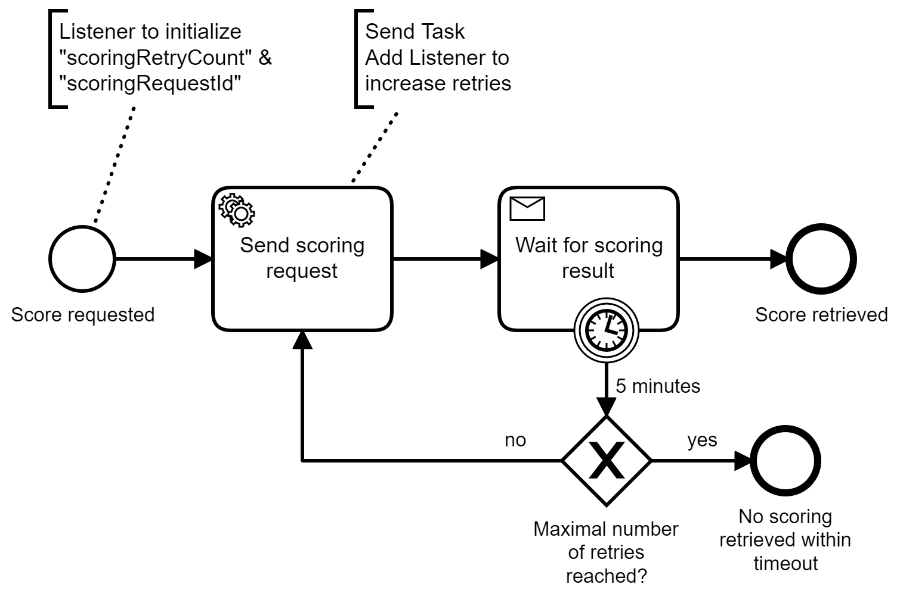

# Customer Onboarding Process - Extended Example

*Process solution example for customer onboarding as used in the OReilly book [Practical Process Automation](https://processautomationbook.com/).*

This following stack is used:

* Camunda Cloud
* Java
* Spring Boot

# Under Construction Warning

This example is still under construction (as we are still approaching Camunda Cloud GA), so it might not work as expected out-of-the-box for you just yet.

It also contains some workarounds for for features missing in Camunda Cloud (but that are on the near term roadmap):

* User Task & Form for the user to approve customer orders are missing, simulated by service task simply completing user tasks
* Own DMN Worker because DMN Integration doesn#t yet work out of the box

# Simple Process

The simple process is meant to get started with process automation, workflow engines and BPMN:

You can find it here: https://github.com/berndruecker/customer-onboarding-camundacloud-springboot

The process model contains three tasks:

* A service task that executes Java Code to score customers
* A user task so that humans can approve customer orders (or not)
* A service task that executes glue code to call the REST API of a CRM system

# Extended Process

The extended process model adds some more tasks in the process:

* A DMN decision task that decides, if a customer order can be automatically processed or not (replacing the manual approval above)
* Scoring the customer will now be done via an external scoring service, that has an AMQP (messaging) API. The technical details around communication via AMQP are extracted in a seperate subprocess:

The process solution is a Maven project and contains:

* The process models as BPMN
* Source code to provide the REST API for clients (using Spring Boot)
* Java code to do the customer scoring
* Glue code to implement the REST call to the CRM system
* Glue code for AMQP communication
* Fakes for CRM system and AMQP

Worarounds for missing features in Camunda Cloud (that are on the near term roadmap):
* User Task & Form for the user to approve customer orders are missing, simulated by service task simply completing user tasks
* Own DMN Worker because DMN Integration doesn#t yet work out of the box

